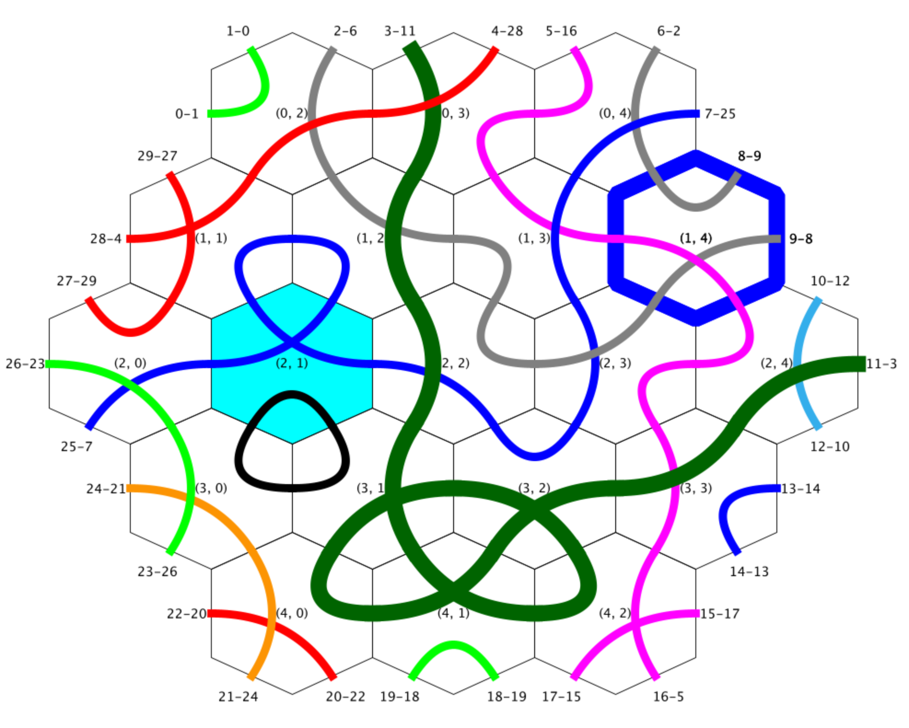
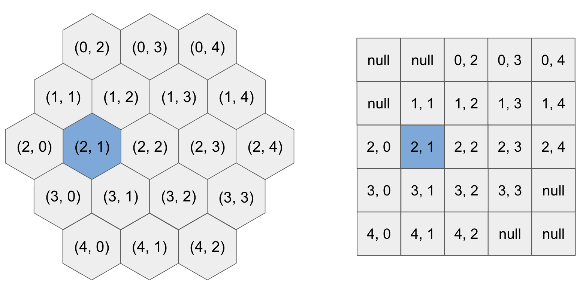
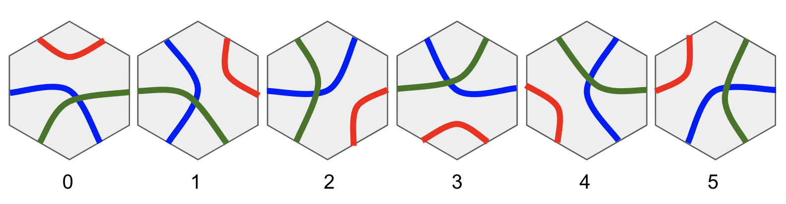

# Marathon Match 166: HexTiles（日本語訳）

> 原文の問題説明を日本語に翻訳したものです。サイト共通のナビゲーション、案内リンク、フッターは省略しています。

## 概要

Hex Tile は、6つの辺が3本の線分によって2辺ずつ接続された六角形のタイルです。これらのタイルは、各辺に `N` 枚のタイルを持つ六角形グリッド上に配置されます。

隣接するタイル間で線分が接続されると、グリッドを横断する**経路（path）**が形成されます。経路は、グリッド境界上にあるタイルの辺からグリッドへ入り、別の境界辺から出ます。

グリッド内には `B` 個の**ボーナスタイル（bonus tile）**があり、経路がそれらを通過するとボーナス点を得られます。各ターンでは、タイルを1枚選び、時計回りまたは反時計回りに回転できます。

出口の組の一覧が与えられます。あなたの目的は、指定された出口どうしを経路で接続することです。

### マッチした経路と得点

指定された出口の組を接続する経路を、**マッチした経路（matched path）**と呼びます。

マッチした経路1本の得点は、次の式で計算されます。

\[
\text{経路得点}=\text{経路長}\times(b+1)
\]

- 経路長: 経路に含まれる線分の本数
- `b`: その経路が通過するボーナスタイル数

すべてのマッチした経路の得点の合計を `t` とします。最終スコアは次のとおりです。

\[
\text{最終スコア}
=
\text{マッチした経路数}\times(t-mM)
\]

- `m`: 実行した回転操作の回数
- `M`: 入力で与えられる1回あたりの操作ペナルティ

最終スコアが負になった場合は `0` になります。

## 例

次の図は `seed=1` に対する解の一例です。



- 色付きの経路: マッチした経路
- 灰色の経路: マッチしていない経路
- 黒色の経路: ループ
- 太線の経路: 最も得点が高い経路
- シアン色のタイル: ボーナスタイル
- 太い枠線のタイル: 最後に回転したタイル
- 各タイル中央の数字: `-showCoords` 使用時に表示される座標 `(row, column)`
- 境界タイル周辺の `p-q`: 目標となる出口の組。出口 `p` と出口 `q` を接続する必要がある

出口IDは `0` 始まりです。左上のタイルにある出口 `0` から、時計回りに番号が付けられます。

## 六角形グリッドの表現

サイズ `N` の六角形グリッドは、次の大きさの正方形グリッドとして表現されます。

\[
W=2N-1
\]

したがって、配列上の大きさは `W × W` です。正方形グリッドの四隅には使用されないセルがあり、それらは `null` として扱われます。

次の図は、六角形グリッドと `(row, column)` 形式の配列座標との対応を示しています。



## タイル形式

各タイルには、その6辺を2辺ずつ結ぶ3本の線分があります。線分の配置はタイルの向きによって決まり、向きは `0` から `5` までの整数で表されます。



## 入力と出力

### 入力

プログラムには、以下の値がそれぞれ別の行で与えられます。

1. `N`: グリッドサイズ
2. `M`: 1回の操作に対するペナルティ
3. `B`: ボーナスタイル数
4. `P`: 接続対象となる出口ペア数
5. 続く `P` 行: 出口ペアを `p q` の形式で表したもの
   - `p`, `q` は `0` 始まりの出口ID
6. 続く `W × W` 行: グリッドを行優先順で表したもの
   - 各タイルの向きは `0` から `5`
   - 使用されないセルは `-1`
7. 続く `B` 行: ボーナスタイルの位置を `row column` の形式で表したもの
   - 座標は `0` 始まり

ここで `W = 2N - 1` です。

### 出力

解は以下を出力しなければなりません。

1. `m`: 操作回数
2. 続く `m` 行: 各操作を `r c dir` の形式で表したもの

操作は座標 `(r, c)` のタイルを回転します。`r`, `c` はともに `0` 始まりです。

- `dir = +1`: 時計回り
- `dir = -1`: 反時計回り

## 採点

### 生スコア

各テストケースの**生スコア（raw score）**は、解によって得られた最終スコアです。

出力が不正な場合、そのテストケースの生スコアは `-1` になります。不正と判定される例は次のとおりです。

- 操作の出力形式が不正
- 操作回数が `24 × N × N` を超えている
- グリッド範囲外のタイルを回転しようとした
- 回転方向が不正
- 制限時間を超過した

### 正規化スコア

生スコアが負の場合、そのテストケースの正規化スコアは `0` です。

それ以外の場合、各テストケースの正規化スコアは次の式で計算されます。

\[
\frac{\text{YOUR}}{\text{MAX}}
\]

- `YOUR`: あなたの生スコア
- `MAX`: そのテストケースで現在得られている最大の正の生スコア
  - 各参加者について、最新の提出のみを対象とする

最後に、全テストケースのスコア合計が `100` 点満点になるよう正規化されます。

## テストケース生成

正確な生成方法については、ビジュアライザのソースコード内にある `generate()` メソッドを参照してください。

各テストケースは次のように生成されます。

- `N`: `3` 以上 `20` 以下
- `M`: `1` 以上 `5` 以下
- `B`: `1` 以上 `10` 以下
- **目標グリッド**
  - 各タイルの向きを `0` から `5` の範囲でランダムに生成する
  - 目標グリッド上で形成された経路から、接続対象となる出口ペアを決定する
- **入力として与えられるグリッド**
  - 各タイルの向きを `0` から `5` の範囲でランダムに生成する
- グリッド内から、互いに異なる `B` 個のボーナスタイルをランダムに選ぶ
- すべての値は一様ランダムに選ばれる

## 制約・補足

- 実行時間制限: 1テストケースあたり `10` 秒
  - あなたのプログラム内で消費した時間のみを含む
- メモリ制限: `1024 MB`
- コンパイル時間制限: `30` 秒
- サンプルテストケース: `10` 個
- 暫定テストケース: `100` 個
- 最終テストケース: `5000` 個
- このマッチはレーティング対象

## 対応言語

- C#
- Java
- C++
- Python
- Rust
- Kotlin

## 提出形式

- 提出物は、ソースコードのみを含む単一のZIPファイルとする
- ZIPファイルの上限サイズは `500 MB`
- ソースファイルをフォルダに入れてから圧縮してはならない
- ソースファイル自体を直接ZIPに格納する
- ソースコードのファイル名は、次の形式にする

```text
HexTiles.<適切な拡張子>
```

## サンプル提出

原文では、ビジュアライザで実行できるよう調整された以下のサンプル解が提供されています。

- Java: `HexTiles.java.zip`
- C++: `HexTiles.cpp.zip`
- Python: `HexTiles.py.zip`
- C#: `HexTiles.cs.zip`
- Rust: `HexTiles.rs.zip`
- Kotlin: `HexTiles.kt.zip`

## ツール

ローカルで解をテスト・デバッグするためのオフラインテスターが提供されています。テスターのソースコードでは、テストケース生成とスコア計算の正確な実装も確認できます。

### ダウンロード対象

- ビジュアライザのソース: `HexTilesTester.zip`
- ビジュアライザ本体: `tester.jar.zip`

### オフラインテスター／ビジュアライザ

解プログラムは、標準入力からデータを読み、標準出力へ結果を書き出すことでテスター／ビジュアライザと通信します。

実行例:

```bash
java -jar tester.jar -exec "<command>" -seed <seed>
```

- `<command>`: 解プログラムを実行するコマンド
- `<seed>`: テストケース生成に使用するシード

コンパイル済みの実行ファイルを使う場合、`<command>` には実行ファイルのフルパスを指定します。

```text
C:\TopCoder\HexTiles.exe
~/topcoder/HexTiles
```

インタプリタを介して実行する場合は、たとえばJavaなら次のように指定します。

```text
java -cp C:\TopCoder HexTiles
```

### オプション

| オプション | 内容 |
|---|---|
| `-seed <seed>` | テストケース生成用シードを指定する。`0` はランダムなグリッド、`1` は各パラメータの最小値、`2` は最大値を使用する。既定値は `1` |
| `-debug` | デバッグ情報を表示する |
| `-noanimate` | アニメーションを表示せず、最終状態のみ表示する |
| `-novis` | 可視化を無効にする |
| `-manual` | 手動でプレイする。左クリックで反時計回り、右クリックで時計回りに回転する |
| `-pause` | 一時停止モードで開始する |
| `-delay <delay>` | 連続するシミュレーション手順の表示間隔をミリ秒単位で指定する。既定値は `100` |
| `-showCoords` | タイル座標を表示する |
| `-showOriginal` | 目標グリッドを入力グリッドとして設定して表示する |
| `-N <N>` | グリッドサイズを指定する |
| `-M <M>` | 操作ペナルティを指定する |
| `-B <B>` | ボーナスタイル数を指定する |

### 表示モード

ビジュアライザには、通常モードと一時停止モードがあります。

- **通常モード**: `-delay` で指定した間隔ごとに、操作を順番に表示する
- **一時停止モード**: キーを押したときだけ次の操作を表示する
- Spaceキーで通常モードと一時停止モードを切り替えられる
- 既定の開始モードは通常モード
- `-pause` を指定すると一時停止モードで開始する

Marathon用ローカルテスターには、このほかにも次のような機能があります。

- 1つのコマンドで複数シードを範囲指定して実行する
- 複数シードを並列実行する
- 制限時間を変更する
- 標準入力・標準出力・標準エラーを保存する
- ファイルから解を読み込む

詳細な使用方法は原文の案内リンクを参照してください。
